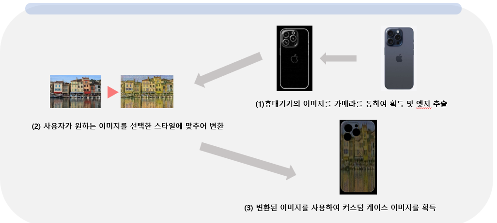
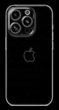
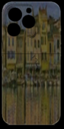
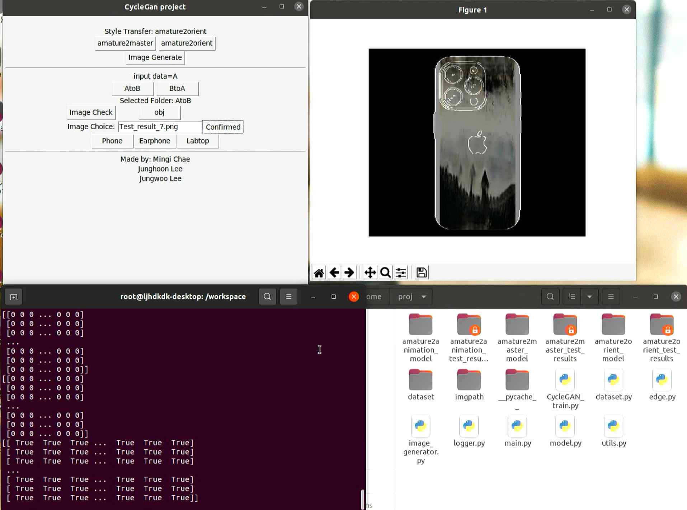
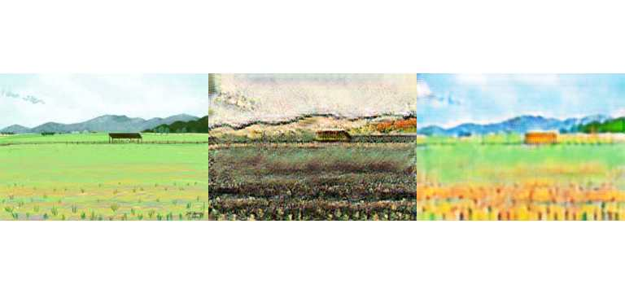
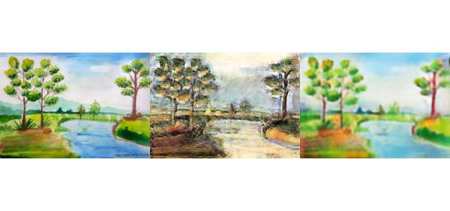
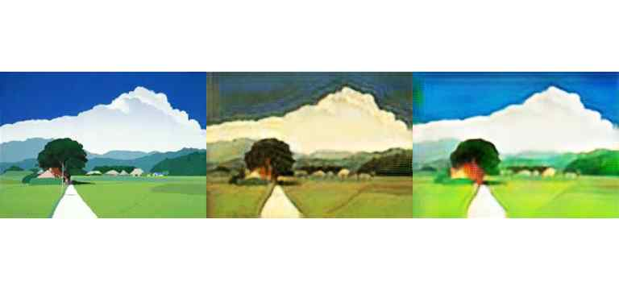

# CYCLE GAN을 활용한 커스텀 케이스 이미지 메이커

### 팀 정보
- **팀명**: 금요일 3조
- **팀원**: 
  - 채민기 (202114160, 팀장)
  - 이정훈 (201910913)
  - 이정우 (201910910)
- **담당 교수**: 조용범 교수님
- **과목**: 전기전자기초설계 및 실습 (3학년)
- **프로젝트 발표 일자**: 2023.12.20

---

## 프로젝트 개요

### 동기
- 사용자가 원하는 이미지를 다양한 스타일로 변환하여 개인의 기기에 맞는 커스텀 케이스 이미지를 손쉽게 제작하도록 지원하기 위해 CycleGAN 모델을 사용하였습니다. CycleGAN은 unpaired 데이터셋으로 학습이 가능하여, 다양한 스타일 변환에 유리합니다.

### 목적
- CycleGAN 모델을 학습시키고, 생성된 모델을 활용해 사용자가 선택한 스타일의 커스텀 케이스 이미지를 생성하는 환경을 구축합니다.

---

## 프로젝트 구성 요소

### 1. CycleGAN 모델
- **CycleGAN 특징**: 일반적인 Pix2Pix 모델과 달리, CycleGAN은 paired 이미지가 필요하지 않습니다. Cycle consistency (순환 일관성)를 통해 이미지 변환과 원본 복원을 동시에 만족시킵니다.
  
### 2. ResNet 사용
- **ResNet**: 잔차 연결을 활용하여 학습 과정을 최적화하며, 층이 깊어질수록 이전 층의 학습 정보를 전달하여 빠른 수렴을 유도합니다.

---

## 프로젝트 흐름도

1. **이미지 획득 및 엣지 추출**
    - 카메라를 통해 기기 이미지를 획득하고 엣지 검출을 통해 필요한 윤곽선을 추출합니다.
    - 

2. **이미지 스타일 변환**
    - 사용자가 원하는 이미지를 특정 스타일로 변환합니다.
    - 

3. **커스텀 케이스 생성**
    - 변환된 이미지를 합성하여 기기에 맞는 커스텀 케이스 이미지를 생성합니다.
    - 

---

## 코드 설명

### 주요 파일 및 역할
- `CycleGAN_train.py`: CycleGAN 모델을 학습시키고, 학습된 가중치를 `.pkl` 파일로 저장합니다.
- `image_generator.py`: 저장된 모델 가중치를 사용해 이미지를 생성하며, 특정 스타일로 변환된 이미지를 출력합니다.
- `edge.py`: 기기의 윤곽선을 추출하여 스타일 변환된 이미지와 결합합니다.
- `main.py`: GUI 인터페이스를 통해 사용자에게 데이터를 입력받고, 이미지 생성 및 저장 경로를 설정할 수 있습니다.

### 하이퍼파라미터 설정
- **Batch Size**: 16
- **ResNet Blocks**: 14
- **Learning Rate**: Generator와 Discriminator의 학습률 각각 `3e-6`
- **Optimizer**: Adam (beta1=0.7, beta2=0.9)
- **Epochs**: 총 400 epoch, 315 epoch 이후 학습률 감소 적용

---

## 실험 결과

### 학습 결과
- **성공 사례**: 스타일 변환된 이미지가 원본과의 consistency를 유지하며 잘 학습됨.
  - 예시 이미지: 일반인의 사진을 동양화 스타일로 변환한 결과
  - 
  - 

- **실패 사례**: 데이터가 부족하거나 스타일 차이가 큰 경우 변환 품질이 저하됨.
  - 예시 이미지: 원본과 매칭이 잘 안 되는 스타일 변환 결과
  - 
  - 

### 결론
- CycleGAN 기반 커스텀 케이스 이미지 메이커를 통해 사용자는 원하는 스타일의 이미지를 생성하여 개성있는 케이스 디자인을 쉽게 만들 수 있습니다.
- 다만 CycleGAN 모델은 스타일의 색상과 분위기를 변화시키는 데는 강점을 보였으나, 물체의 형태 변화에는 한계가 있습니다. 이를 보완하기 위해 Stable Diffusion 같은 다른 이미지 생성 모델을 활용하는 방안이 제안됩니다.

---

  
